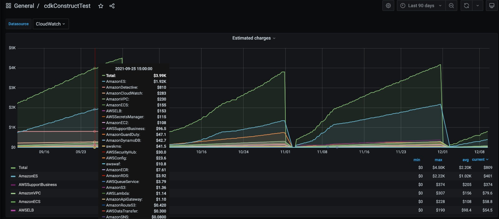

# cdk-grafana-json-dashboard-handler

A handler Custom Construct for JSON Grafana Dashboards - Deploy to Grafana using AWSCDK.

## How it works

Declare the package as a dependency and import the Construct in your stack. Point it to your local Grafana dashboard file so the Construct can calculate an MD5 hash of it. This is needed as otherwise CloudFormation would not know when to redeploy your dashboard to Grafana when it changes. Upload your dashboard file in your CDK stack (s3assets, see example below), and pass the bucket and s3 file path to the Construct as well. Also, give the Construct a secret to resolve from SecretsManager in order to authenticate to your Grafana installation, in combination with the url where to find it. Finally give it a name so it can name your dashboard accordingly. Deploy!

## Contents of the Custom Construct

The Construct contains a Lambda Singleton function, which gets wrapped by a CloudFormation Custom Resource.

## Before using consider the following

1. This construct is geared towards deploying json dashboards. This construct does not cater towards DSL for creating and developing Grafana Dashboards. The construct assumes you will place this json dashboard somewhere in S3. Consider deploying it using `new s3assets.BucketDeployment` and then pass the object path & bucket name to the construct so it knows where to fetch it.

2. This construct assumes Bearer authorization, in which the value of Bearer is stored in AWS Secretsmanager, either plain or in an object for which you can specify the key, e.g. `'password'` or `{'pass' : 'password'}`

3. This construct currently does NOT support custom KMS encrypted files in s3 (see roadmap below)

## Grafana Handler

Implement as following:

Write your Grafana Dashboard JSON file somewhere to disk.

Use that Dashboard JSON in your stack as follows:

```ts
// setup the dependencies for the construct, for example like this
const bucket = new s3.Bucket(this, "pogg", {
  autoDeleteObjects: true,
  removalPolicy: cdk.RemovalPolicy.DESTROY,
});

const fdp = new s3assets.BucketDeployment(this, "pogu", {
  sources: [s3assets.Source.asset("test/dashboard")],
  destinationBucket: bucket,
  destinationKeyPrefix: "test/test",
});

const secret = sm.Secret.fromSecretPartialArn(
  this,
  "smLookup",
  getRequiredEnvVariable("GRAFANA_SECRET_PARTIAL_ARN")
);
```

```ts
const dbr = new GrafanaHandler(this, "pog", {
  dashboardAppName: "cdkConstructTest",
  grafanaPwSecret: secret,
  grafanaUrl: getRequiredEnvVariable("GRAFANA_URL"),
  bucketName: bucket.bucketName,
  objectKey: "test/test/dashboard/test-dashboard.json",
  localFilePath: "test/dashboard/test-dashboard.json",
});
dbr.node.addDependency(fdp);
```

If your handler needs to live inside your projects networking tier:

```ts
const dbr = new GrafanaHandler(this, "pog", {
  dashboardAppName: "cdkConstructTest",
  grafanaPwSecret: secret,
  grafanaUrl: getRequiredEnvVariable("GRAFANA_URL"),
  bucketName: bucket.bucketName,
  objectKey: "test/test/dashboard/test-dashboard.json",
  localFilePath: "test/dashboard/test-dashboard.json",
  vpc: testingVpc,
  vpcSubnets: {
    subnets: [
      testingPrivateSubnetID1,
      testingPrivateSubnetID2,
      testingPrivateSubnetID3,
    ],
  },
});
dbr.node.addDependency(fdp);
```

## More permissions

Whenever your handler needs more permissions use the `addToRolePolicy` on the properties exposed on the construct:

```ts
const dbr = new GrafanaHandler(this, "pog", {
  dashboardAppName: "cdkConstructTest",
  grafanaPw: process.env.pw, // pass in a string value. CDK supports resolving to string values from SSM and SecretsManager
  grafanaUrl: process.env.url,
  pathToFile: "../src/test/test-dashboard.json",
  localFilePath: "test/dashboard/test-dashboard.json",
});

dbr.grafanaHandlerFunction.addToRolePolicy(
  new iam.PolicyStatement({
    actions: ["ec2:*"],
    resources: ["*"],
  })
);
```

## Example deployment



## TODO / Roadmap

1. Add custom KMS key support for the dashboard files in s3.
2. Reduce SecretsManager permissions
